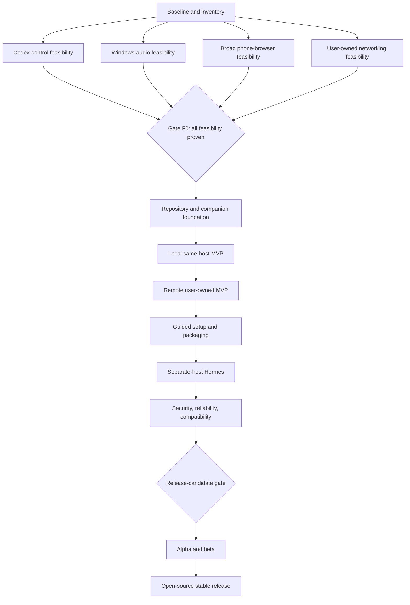

# Hermes Codex Voice Remote — Checkpoint Map

Generated: 2026-08-31  
Status: Planning and feasibility; CP-002, CP-003, and CP-004 Complete; CP-010, CP-020, CP-030, and CP-040 Ready  
Canonical plan: [`docs/plan.md`](plan.md)  
Maintainer project index: private; not included in this repository

> [!IMPORTANT] Mandatory implementation workflow
> **Codex is the planner, technical reviewer, and checkpoint authority. Grok 4.6 in Cursor is the implementation/worker agent.** Before any checkpoint is implemented, Codex writes a checkpoint-specific implementation plan with scope, files, tests, evidence, and acceptance criteria. Grok 4.6 implements that plan without expanding its scope. Codex then independently inspects the changes, runs or verifies the required tests, and compares the evidence with the checkpoint criteria. If the work passes, Codex updates this checkpoint map and the private maintainer project index, commits and pushes the accepted public-safe checkpoint outcome to `main`, and plans the next checkpoint. Private machine evidence, credentials, audio, transcripts, prompts, task content, and personal paths are excluded from the public commit. If the work fails or is incomplete, Codex writes a precise rework request for Grok and reviews the revision again; failed or unaccepted work is not represented as a completed-checkpoint commit. A worker report alone never completes a checkpoint, and a different implementation agent is not substituted without the user's approval.

## 1. How this map is used

This document converts the product plan into stable, ordered checkpoints. It is the execution map, not a calendar estimate.

Each checkpoint has:

- A permanent ID.
- A status.
- Dependencies that must already be complete.
- A concrete objective.
- Required implementation or investigation work.
- Artifacts that must be saved.
- Evidence that must be produced.
- Pass criteria that must all be true.
- A failure route that prevents pretending the checkpoint passed.
- The later work it unlocks.

Allowed statuses:

- **Complete** — every pass criterion is satisfied and evidence is linked.
- **In progress** — work has started, but the exit gate has not passed.
- **Blocked** — a named dependency or external condition prevents progress.
- **Pending** — ready or waiting, but not started.
- **Failed** — evidence disproved the current approach; follow the failure route.
- **Superseded** — replaced by a documented architecture decision. Never silently delete it.

Rules:

1. A checkpoint is not complete because code exists. It is complete only when its verification evidence passes.
2. Evidence must be reproducible and saved under the future implementation repository or this planning workspace until that repository exists.
3. A failed feasibility checkpoint stops dependent production work.
4. Every status change must update the Obsidian project note's progress ledger.
5. Any scope or architecture change must be recorded as an Architecture Decision Record (ADR) and linked from this map.
6. No full installer, public beta, or release work begins before Gate F0 passes.
7. Audio, prompts, transcripts, Codex responses, credentials, and secrets must not appear in evidence bundles.
8. After Codex accepts a checkpoint, publish one public-safe commit to `main` containing the accepted code/docs/tests and sanitized status/evidence references. Keep private evidence out of Git, verify the remote push, and record the commit hash in the private maintainer ledger.

## 2. Milestone dependency map

Four feasibility tracks may be investigated independently after the baseline is captured, but Gate F0 requires all four to pass.

## 3. Master checkpoint dashboard

| ID | Checkpoint | Status | Depends on |
|---|---|---|---|
| CP-000 | Canonical product plan | Complete | — |
| CP-001 | Living Obsidian project index | Complete | CP-000 |
| CP-002 | Target hardware and software inventory | Complete | CP-001 |
| CP-003 | Privacy, threat-boundary, and data-flow baseline | Complete | CP-002 |
| CP-004 | Feasibility workspace and evidence harness | Complete | CP-002 |
| CP-010 | Codex installation, process, package, and protocol discovery | Ready | CP-004 |
| CP-011 | Deterministic Codex launch and session control | Pending | CP-010 |
| CP-012 | Recent-task enumeration and stable task identity | Pending | CP-010 |
| CP-013 | Exact create/open/verify task control | Pending | CP-011, CP-012 |
| CP-014 | Codex Voice start, ready, error, and stop detection | Pending | CP-013 |
| CP-015 | Fail-closed Codex adapter prototype | Pending | CP-014 |
| CP-016 | Codex-control reliability qualification | Pending | CP-015 |
| CP-020 | Test virtual microphone and licensing inventory | Ready | CP-004 |
| CP-021 | Phone/sample PCM injection proof | Pending | CP-020 |
| CP-022 | Process-specific Codex output capture proof | Pending | CP-020 |
| CP-023 | Full-duplex local audio graph | Pending | CP-021, CP-022 |
| CP-024 | Audio isolation and no-fallback enforcement | Pending | CP-023 |
| CP-025 | Audio crash recovery and setting restoration | Pending | CP-024 |
| CP-026 | Windows-audio qualification and production-component ADR | Pending | CP-025 |
| CP-030 | Mobile capability probe and representative browser inventory | Ready | CP-004 |
| CP-031 | Minimal secure phone page and microphone permission | Pending | CP-030 |
| CP-032 | Phone-browser-to-PC LAN WebRTC proof | Pending | CP-031, CP-023 |
| CP-033 | Minimal call controls and accessible interaction | Pending | CP-032 |
| CP-034 | Phone interruption, routing, background, and network matrix | Pending | CP-033 |
| CP-035 | Mobile-browser qualification and support-floor ADR | Pending | CP-034 |
| CP-040 | User-owned provider requirements and adapter contract | Ready | CP-003, CP-004 |
| CP-041 | Reference provider and stable HTTPS route proof | Pending | CP-040 |
| CP-042 | Signaling plus direct ICE/STUN proof | Pending | CP-041, CP-032 |
| CP-043 | Forced TURN relay proof | Pending | CP-042 |
| CP-044 | Device pairing and ephemeral session-auth prototype | Pending | CP-003, CP-041 |
| CP-045 | Remote reconnect, teardown, and network-roaming proof | Pending | CP-043, CP-044 |
| CP-046 | User-owned remote-network qualification | Pending | CP-045 |
| CP-050 | Gate F0 — feasibility review and architecture freeze | Blocked | CP-016, CP-026, CP-035, CP-046 |
| CP-100 | Implementation repository, licensing baseline, and CI | Blocked | CP-050 |
| CP-101 | Versioned protocols and lifecycle state machine | Blocked | CP-100 |
| CP-102 | Secure local IPC and companion skeleton | Blocked | CP-101 |
| CP-103 | Codex, audio, phone, and provider simulators | Blocked | CP-102 |
| CP-104 | Privacy-preserving logs and diagnostic bundle | Blocked | CP-103 |
| CP-110 | Production companion lifecycle | Blocked | CP-104 |
| CP-111 | Production Codex adapter | Blocked | CP-110, CP-016 |
| CP-112 | Production audio engine | Blocked | CP-110, CP-026 |
| CP-113 | Embedded production phone page | Blocked | CP-110, CP-035 |
| CP-114 | Hermes plugin tools and bundled skill | Blocked | CP-110, CP-111 |
| CP-115 | New-task LAN end-to-end path | Blocked | CP-111, CP-112, CP-113, CP-114 |
| CP-116 | Resume and recent-task flow | Blocked | CP-115 |
| CP-117 | Busy, reconnect, End Session, and task-preservation behavior | Blocked | CP-116 |
| CP-118 | Gate L0 — local same-host MVP | Blocked | CP-117 |
| CP-120 | Production provider abstraction | Blocked | CP-118, CP-046 |
| CP-121 | Reference-provider provisioning and health checks | Blocked | CP-120 |
| CP-122 | Production device trust, expiry, and revocation | Blocked | CP-121, CP-044 |
| CP-123 | Production session authorization and TURN credentials | Blocked | CP-122 |
| CP-124 | Cellular remote end-to-end path | Blocked | CP-123 |
| CP-125 | Gate R0 — remote user-owned MVP | Blocked | CP-124 |
| CP-130 | Setup-wizard preflight and Codex sign-in flow | Blocked | CP-125 |
| CP-131 | Audio-component install, repair, and uninstall flow | Blocked | CP-130 |
| CP-132 | Provider setup and approval flow | Blocked | CP-130, CP-121 |
| CP-133 | Phone pairing and automated end-to-end setup test | Blocked | CP-131, CP-132 |
| CP-134 | One-package build, upgrade, rollback, and uninstall | Blocked | CP-133 |
| CP-135 | Gate I0 — clean-machine installation qualification | Blocked | CP-134 |
| CP-140 | Separate-host Hermes control channel | Blocked | CP-135 |
| CP-141 | Separate-host security and recovery behavior | Blocked | CP-140 |
| CP-142 | Gate H0 — separate-host Hermes qualification | Blocked | CP-141 |
| CP-150 | Security and privacy adversarial suite | Blocked | CP-142 |
| CP-151 | Reliability, soak, crash, and roaming suite | Blocked | CP-142 |
| CP-152 | Supported compatibility matrix | Blocked | CP-150, CP-151 |
| CP-153 | User documentation and sanitized diagnostics | Blocked | CP-152 |
| CP-154 | Dependency, license, signing, and supply-chain review | Blocked | CP-153 |
| CP-155 | Gate RC0 — release-candidate qualification | Blocked | CP-154 |
| CP-160 | Creator alpha on the target setup | Blocked | CP-155 |
| CP-161 | Small external self-hosted beta | Blocked | CP-160 |
| CP-162 | Beta defect closure and support-boundary freeze | Blocked | CP-161 |
| CP-163 | Open-source stable release | Blocked | CP-162 |
| CP-164 | Post-release compatibility and maintenance policy | Blocked | CP-163 |

## 4. Baseline checkpoints

### CP-000 — Canonical product plan

**Status:** Complete  
**Depends on:** None

**Objective:** Preserve the full product contract, architecture, phases, risks, and release definition before implementation begins.

**Artifacts:**

- `docs/plan.md`

**Evidence and pass criteria:**

- The plan exists and contains the product definition, user journeys, internal modules, security model, state model, feasibility gates, phased build, risks, testing, and release criteria.
- Decisions from the design conversation are represented without treating unresolved feasibility questions as settled facts.

**Failure route:** Amend the canonical plan and record the change before altering dependent checkpoints.

**Unlocks:** CP-001.

### CP-001 — Living Obsidian project index

**Status:** Complete  
**Depends on:** CP-000

**Objective:** Maintain a human-readable project home containing the product description, current status, file locations, and progress ledger.

**Artifacts:**

- Private maintainer project index (not included in this repository)

**Evidence and pass criteria:**

- The note exists in the vault.
- It identifies the canonical plan and planning workspace.
- It states that implementation has not begun.
- It contains update rules for checkpoint changes.

**Failure route:** Repair the note before execution continues; do not let project state live only in chat history.

**Unlocks:** CP-002.

### CP-002 — Target hardware and software inventory

**Status:** Complete  
**Depends on:** CP-001

**Objective:** Capture the exact environment the first implementation must support so compatibility is tested against facts.

**Work:**

- Record Windows edition, version, build, architecture, user-session behavior, and whether the PC normally locks or sleeps.
- Record Codex/ChatGPT desktop package version, installation source, package identity, executable locations, and update channel.
- Record Hermes version, installation location, Telegram transport status, and whether Hermes runs on the Codex PC.
- Record the decided client scope: broad capability-based phone-browser support rather than one model; exact representative device/browser versions are selected and measured in CP-030 rather than blocking this host inventory.
- Record the desired phone behavior: the active browser uses the OS-selected microphone/output route like a normal call; native-call-style background/lock behavior is desired but must be measured rather than assumed.
- Record PC microphones, speakers, Bluetooth devices, audio drivers, existing virtual audio components, and default communications devices.
- Record available user-owned provider accounts, domains, VPSs, or tunnel tools without printing secrets. Record that Cloudflare is the intended first provider, a provider-assigned address is acceptable, no custom domain is required, Hermes sends the current link, and any potentially billable operation requires explicit approval at execution time.
- Record the expected normal networks: home Wi-Fi, external Wi-Fi, and cellular carrier.

**Artifacts:**

- Private maintainer environment inventory (not included in this repository).
- Private machine-readable inventory (not included in this repository).
- Private independent review (not included in this repository).

**Evidence and pass criteria:**

- Every required field is filled or explicitly marked unknown with a collection method.
- No credential, token, serial number, phone number, public IP, or other unnecessary sensitive value is stored.
- The private maintainer project index links the inventory and states the capability-based mobile target and later representative-device test responsibility.

**Failure route:** Stop unsupported compatibility claims and gather any missing host/provider decisions; exact phone/browser evidence remains owned by CP-030.

**Unlocks:** CP-003, CP-004.

### CP-003 — Privacy, threat-boundary, and data-flow baseline

**Status:** Complete  
**Depends on:** CP-002

**Objective:** Define what data each component may see, store, transmit, and trust before remote connectivity exists.

**Work:**

- Diagram Hermes, Telegram, the Windows companion, Codex, virtual audio, phone browser, provider tunnel, STUN, and TURN boundaries.
- List assets: OpenAI session, provider credentials, Telegram authorization, device keys, task identity, microphone audio, Codex output, logs, and update artifacts.
- List threat actors: random internet user, leaked current/persistent URL, malicious paired device, compromised provider account, local unprivileged process, replay attacker, and compromised update artifact.
- Freeze privacy invariants: no bridge recording, no added transcript, no secrets in prompts/logs, URL not sufficient for access, phone cannot activate Codex, and End Session preserves the task.
- Define what sanitized operational metadata may be logged.
- Define owner authorization assumptions inherited from Hermes/Telegram.

**Artifacts:**

- Checkpoint implementation plan: [`docs/checkpoints/cp-003-privacy-threat-data-flow-implementation-plan.md`](checkpoints/cp-003-privacy-threat-data-flow-implementation-plan.md)
- `docs/security/threat-model-v0.md`
- `docs/security/data-flow-v0.md`
- ADR for user-owned infrastructure and no mandatory shared service.

**Evidence and pass criteria:**

- Every network and process boundary has an identified authentication method or is explicitly out of scope.
- Media confidentiality, device revocation, provider-secret storage, local IPC, and software-update trust have named controls.
- The document is reviewed against the plan and contains no contradiction.

**Failure route:** Revise architecture before CP-040 or any public endpoint work.

**Unlocks:** CP-040, CP-044.

### CP-004 — Feasibility workspace and evidence harness

**Status:** Complete  
**Depends on:** CP-002

**Objective:** Create a disposable, reproducible place for spikes without prematurely scaffolding the production repository.

**Work:**

- Create isolated spike directories for Codex control, Windows audio, phone browser, and networking.
- Add a README explaining how evidence is captured and scrubbed.
- Add scripts for timestamped test summaries, dependency versions, and pass/fail output.
- Add a privacy filter that rejects obvious tokens, task content, transcripts, and audio recordings from committed evidence.
- Define common measurement fields: action, expected state, observed state, duration, result, error category, and cleanup state.

**Artifacts:**

- Checkpoint implementation plan: [`docs/checkpoints/cp-004-feasibility-workspace-evidence-harness-implementation-plan.md`](checkpoints/cp-004-feasibility-workspace-evidence-harness-implementation-plan.md)
- Private maintainer feasibility harness and track directories (not included in this repository).

**Evidence and pass criteria:**

- Each track can produce a sanitized, dated result file.
- Forced-failure examples prove the harness records failure and cleanup accurately.
- Nothing is packaged or presented as production code.

**Failure route:** Repair the harness before technical conclusions are accepted.

**Unlocks:** CP-010, CP-020, CP-030, CP-040.

## 5. Codex-control feasibility checkpoints

### CP-010 — Codex installation, process, package, and protocol discovery

**Status:** Ready  
**Depends on:** CP-004

**Objective:** Build a verified map of the installed Codex desktop surface without assuming undocumented controls are stable.

**Work:**

- Detect installation through supported Windows package APIs.
- Record package identity, version, executable process tree, window classes, and launch behavior.
- Inspect the registered `codex://` handler and safely enumerate only discoverable/documented routes.
- Inspect accessibility/UI Automation trees for task lists, title fields, new-task controls, and Voice controls.
- Identify possible supported local APIs, command-line entry points, deep links, or remote-control components.
- Do not mutate account files or reverse engineer secrets.

**Artifacts:**

- Checkpoint implementation plan: [`docs/checkpoints/cp-010-codex-surface-discovery-implementation-plan.md`](checkpoints/cp-010-codex-surface-discovery-implementation-plan.md)
- Discovery script.
- Sanitized capability report.
- Initial Codex adapter capability matrix.

**Evidence and pass criteria:**

- The installed version and process/window identities are detected repeatedly.
- Candidate control paths are ranked: supported API/deep link, native automation, UIA, keyboard, last-resort vision.
- Each finding states whether it is documented, observed, or inferred.

**Failure route:** If Codex cannot be detected reliably, stop the automation track and document the supported manual prerequisite.

**Unlocks:** CP-011, CP-012.

### CP-011 — Deterministic Codex launch and session control

**Status:** Pending  
**Depends on:** CP-010

**Objective:** Launch or focus Codex from a closed/background state and prove which Windows user session owns it.

**Work:**

- Launch Codex through the strongest candidate path.
- Detect already-running, minimized, backgrounded, and crashed states.
- Verify that the app belongs to the current unlocked user session.
- Determine whether foreground focus is required for later controls.
- Add launch timeout and cleanup behavior.
- Confirm that the process can be observed without treating process start as UI readiness.

**Artifacts:**

- Launch spike.
- Launch-state matrix.
- Timing and failure summary.

**Evidence and pass criteria:**

- Ten consecutive trials from closed state reach a verified usable Codex UI.
- Ten consecutive trials with Codex already open reuse the correct instance.
- Locked/sleeping states fail clearly and never attempt unlock/wake behavior.

**Failure route:** Narrow supported launch conditions or find a stronger control path before proceeding.

**Unlocks:** CP-013.

### CP-012 — Recent-task enumeration and stable task identity

**Status:** Pending  
**Depends on:** CP-010

**Objective:** List recent supported Codex tasks and distinguish them using stable identity rather than title alone.

**Work:**

- Determine whether a supported task API, deep link, local index, or semantic UIA list is available.
- Return up to ten recent tasks with stable ID where available, title, project/context, and coarse recency.
- Create duplicate-title fixtures.
- Exclude unsupported, inaccessible, archived, or unrelated task types.
- Define privacy-safe data returned to Hermes.

**Artifacts:**

- Enumeration spike.
- Task descriptor schema.
- Duplicate-title test report.

**Evidence and pass criteria:**

- The same task retains the same identity across enumeration and open operations.
- Duplicate titles are unambiguous without exposing prompt contents.
- No selection relies solely on row position or visible title.

**Failure route:** If no stable task ID is accessible, require explicit user confirmation using title plus project/recency and document the residual risk; do not claim exact resume until verified.

**Unlocks:** CP-013.

### CP-013 — Exact create/open/verify task control

**Status:** Pending  
**Depends on:** CP-011, CP-012

**Objective:** Create a new task or open one chosen existing task and independently verify the result.

**Work:**

- Implement idempotent create-task and open-task spike operations.
- Verify task identity after navigation.
- Test duplicate titles, slow load, stale list, renamed task, and task not found.
- Prevent a stale command from opening a different task after the list changes.
- Add safe cancellation before Voice starts.

**Artifacts:**

- Task-control spike.
- Act-and-verify state diagram.
- Failure matrix.

**Evidence and pass criteria:**

- Repeated new-task trials identify the created task.
- Every resume trial opens the requested stable identity.
- Wrong-task and ambiguous states fail closed before Voice is activated.

**Failure route:** Stop resume support or narrow it to a verified subset; never route audio to an unverified task.

**Unlocks:** CP-014.

### CP-014 — Codex Voice start, ready, error, and stop detection

**Status:** Pending  
**Depends on:** CP-013

**Objective:** Control the real desktop Codex Voice mode and detect its state using positive evidence.

**Work:**

- Identify Voice start/stop controls or supported commands.
- Detect microphone permission errors, account/plan ineligibility, another active Voice session, loading, ready, ended, and failure.
- Start Voice only after task identity verification.
- Determine whether input device can be selected per app.
- Stop Voice without closing or cancelling the task.
- Add preparation timeout and cleanup.

**Artifacts:**

- Voice-control spike.
- Voice state detector.
- Account and error-state test report.

**Evidence and pass criteria:**

- Ready is detected independently of sending the start action.
- Stop returns Voice to off while the task remains available.
- The system never reports ready on eligibility, permission, or busy errors.

**Failure route:** If Voice lacks a verifiable state, the project cannot safely automate it; investigate a supported remote interface or pause the product path.

**Unlocks:** CP-015.

### CP-015 — Fail-closed Codex adapter prototype

**Status:** Pending  
**Depends on:** CP-014

**Objective:** Wrap discovery, launch, task, and Voice operations behind a version-aware adapter boundary.

**Work:**

- Define adapter capability and error schemas.
- Implement detected-version allowlisting or compatibility checks.
- Separate supported/deep-link, UIA, keyboard, and optional vision strategies.
- Require state verification after every action.
- Add idempotency and stale-command protection.
- Simulate an unknown Codex version and selector changes.

**Artifacts:**

- Prototype adapter interface and implementation.
- Adapter compatibility report.
- Error taxonomy.

**Evidence and pass criteria:**

- Unknown or mismatched versions disable unsafe operations.
- A failed strategy never silently falls through to screen coordinates.
- All required capabilities report supported, unsupported, or degraded explicitly.

**Failure route:** Revise the adapter design or constrain supported Codex versions.

**Unlocks:** CP-016.

### CP-016 — Codex-control reliability qualification

**Status:** Pending  
**Depends on:** CP-015

**Objective:** Decide from repeated evidence whether automated attachment to real Codex Voice is safe enough to build around.

**Work:**

- Run at least 20 consecutive cold-start new-task trials.
- Run at least 20 resume trials including duplicate titles.
- Include Codex already open, minimized, backgrounded, slow-loading, and recovered from crash.
- Force permission, busy, unknown-version, and missing-task failures.
- Confirm cleanup after every failure.

**Artifacts:**

- Qualification report with sanitized trial table.
- Recorded defect list.
- ADR selecting or rejecting the Codex-control path.

**Pass criteria:**

- Zero wrong-task Voice attachments.
- Every successful trial reaches positively verified Voice ready.
- Every injected failure is detected before audio attachment.
- No unsupported fallback occurs.
- Cleanup leaves Codex and the task in a known safe state.

**Failure route:** Mark failed, document the exact failure class, and evaluate stronger supported controls. Gate F0 remains blocked.

**Unlocks:** CP-050 Codex branch.

## 6. Windows-audio feasibility checkpoints

### CP-020 — Test virtual microphone and licensing inventory

**Status:** Ready  
**Depends on:** CP-004

**Objective:** Select a temporary feasibility component and enumerate viable production microphone-injection choices without prematurely committing to a driver.

**Work:**

- Inventory installed audio endpoints and existing virtual devices.
- Evaluate test-only virtual cable options, redistribution terms, administrator needs, reboot behavior, signing, architecture support, and uninstall behavior.
- Document the difference between a test dependency and a production dependency.
- Establish a reversible test setup.

**Artifacts:**

- Checkpoint implementation plan: [`docs/checkpoints/cp-020-virtual-microphone-inventory-implementation-plan.md`](checkpoints/cp-020-virtual-microphone-inventory-implementation-plan.md)
- Audio-device inventory.
- Virtual microphone option matrix.
- Reversible setup and cleanup instructions.

**Evidence and pass criteria:**

- One test endpoint can be installed and removed safely.
- Licensing status is recorded; no unauthorized binary is committed or redistributed.
- Previous default audio settings are captured for restoration.

**Failure route:** Investigate a Microsoft sample/driver path or another documented endpoint. Do not fake microphone injection through speakers.

**Unlocks:** CP-021, CP-022.

### CP-021 — Phone/sample PCM injection proof

**Status:** Pending  
**Depends on:** CP-020

**Objective:** Deliver known PCM and live microphone audio into the virtual endpoint so Codex can consume it as microphone input.

**Work:**

- Implement a minimal PCM sink for the test endpoint.
- Handle channel count, sample rate, buffering, underflow, and silence.
- Verify Codex sees/selects the virtual microphone.
- Determine whether Codex offers per-app microphone selection.
- Measure injection latency and CPU use.

**Artifacts:**

- Injection spike.
- Format/latency report.
- Per-app device-selection finding.

**Evidence and pass criteria:**

- A known test signal and live speech reach Codex through the virtual microphone.
- No audio is played through PC speakers as a workaround.
- Stopping injection produces silence and releases resources.

**Failure route:** Reevaluate the endpoint or driver approach. Global default switching may be evaluated only as an explicit, crash-safe fallback.

**Unlocks:** CP-023.

### CP-022 — Process-specific Codex output capture proof

**Status:** Pending  
**Depends on:** CP-020

**Objective:** Capture only the Codex application's audio output without streaming unrelated system sounds.

**Work:**

- Identify the correct Codex process tree and Windows application-loopback method.
- Capture Codex output across renderer/helper process changes.
- Play unrelated audio and notifications during capture.
- Handle Codex process restart and output-device changes.
- Measure format, latency, and CPU use.

**Artifacts:**

- Capture spike.
- Process-tree mapping.
- Isolation test report.

**Evidence and pass criteria:**

- Codex audio is present and intelligible.
- Unrelated application and system audio is absent.
- No system-wide loopback fallback occurs silently.
- Capture stops and releases devices cleanly.

**Failure route:** Investigate a stronger per-process capture path. Gate F0 cannot pass with system-wide audio leakage.

**Unlocks:** CP-023.

### CP-023 — Full-duplex local audio graph

**Status:** Pending  
**Depends on:** CP-021, CP-022

**Objective:** Run simultaneous microphone injection and Codex output capture in one low-latency graph.

**Work:**

- Connect input decoder/buffer to the virtual microphone.
- Connect Codex process capture to an output encoder/buffer.
- Use WebRTC-compatible sample rates and Opus assumptions where possible.
- Prevent the injected microphone from being monitored into the PC output.
- Measure one-way added latency, jitter, dropouts, and CPU.
- Run a sustained local conversation.

**Artifacts:**

- Full-duplex spike.
- Audio graph diagram.
- Latency and stability report.

**Evidence and pass criteria:**

- Both directions operate simultaneously.
- Audio remains intelligible for 30 minutes.
- There is no obvious feedback loop or PC-speaker monitoring.
- Resource use is acceptable on the target PC; numeric limits are recorded from evidence.

**Failure route:** Isolate codec, buffer, driver, or capture bottleneck; do not advance a half-duplex design as equivalent.

**Unlocks:** CP-024, CP-032.

### CP-024 — Audio isolation and no-fallback enforcement

**Status:** Pending  
**Depends on:** CP-023

**Objective:** Prove privacy and device-selection invariants under abnormal device conditions.

**Work:**

- Unplug or disable the physical PC microphone during a session.
- Remove/restart the virtual endpoint.
- Change default input/output devices.
- Connect and disconnect Bluetooth devices.
- Play unrelated media and notifications.
- Verify mute and output mute behavior.

**Artifacts:**

- Adversarial device test matrix.
- No-fallback assertions.

**Evidence and pass criteria:**

- Loss of the virtual microphone stops input and produces an error; it never selects the physical PC microphone.
- Loss of process capture stops output; it never switches to system-wide capture.
- Mute sends silence without changing global device state.
- Other application audio is absent.

**Failure route:** Add explicit device pinning and fail-closed controls; repeat CP-024.

**Unlocks:** CP-025.

### CP-025 — Audio crash recovery and setting restoration

**Status:** Pending  
**Depends on:** CP-024

**Objective:** Ensure companion or Codex crashes do not leave devices locked, defaults changed, or audio routed incorrectly.

**Work:**

- Force-terminate companion at each audio lifecycle stage.
- Crash/restart Codex during capture.
- Restart the Windows audio service where safe.
- Reboot after an intentionally interrupted setup.
- Verify transactional restoration of any modified setting.
- Detect and reconcile orphaned virtual sessions on restart.

**Artifacts:**

- Crash-injection suite.
- Restoration report.
- Recovery procedure.

**Evidence and pass criteria:**

- Audio devices remain usable after every injected crash.
- Any explicitly modified default is restored.
- Restarted companion detects stale state before starting another session.
- No manual Device Manager recovery is required for supported failures.

**Failure route:** Redesign lifecycle ownership or remove the unsafe fallback that mutates global state.

**Unlocks:** CP-026.

### CP-026 — Windows-audio qualification and production-component ADR

**Status:** Pending  
**Depends on:** CP-025

**Objective:** Approve the audio architecture and make an explicit production virtual-microphone decision.

**Work:**

- Consolidate latency, stability, isolation, and recovery results.
- Compare third-party dependency, redistribution agreement, and first-party signed-driver options.
- Document admin, restart, signing, update, uninstall, license, and maintenance consequences.
- Select a production path or explicitly reject feasibility.

**Artifacts:**

- Audio qualification report.
- ADR selecting the production audio component strategy.
- Updated risk register.

**Pass criteria:**

- Full-duplex, isolation, and recovery checkpoints passed.
- The selected production path has a legal distribution story.
- Installation and removal requirements are acceptable and transparent.
- No unresolved physical-mic or system-audio privacy failure remains.

**Failure route:** Mark failed and block Gate F0 until a supportable endpoint exists.

**Unlocks:** CP-050 audio branch.

## 7. Broad phone-browser feasibility checkpoints

### CP-030 — Mobile capability probe and representative browser inventory

**Status:** Ready  
**Depends on:** CP-004

**Objective:** Establish an evidence-based, capability-driven mobile compatibility target that covers broadly compatible phones without promising every handset.

**Work:**

- Define the required capability set and select representative iOS Safari/WebKit and Android Chromium test combinations; add Android Firefox or other browser families only when they can be verified.
- Include the creator's older phone when available as an important compatibility data point, not as the sole product target.
- Probe secure-context `getUserMedia`, WebRTC, Opus, IndexedDB, WebCrypto/device-key support, WebSocket, and audio input/output behavior. Add to Home Screen is optional and free storage is not a release gate for the normal browser page.
- Probe whether non-extractable device keys are supported.
- Record microphone permission UX and reset behavior.

**Artifacts:**

- Checkpoint implementation plan: [`docs/checkpoints/cp-030-mobile-capability-probe-implementation-plan.md`](checkpoints/cp-030-mobile-capability-probe-implementation-plan.md)
- Mobile capability probe page.
- Sanitized capability report.

**Evidence and pass criteria:**

- Required browser APIs are listed as present, absent, or degraded for every tested browser/OS combination.
- The required iOS and Android browser families each have real-device or appropriately justified physical-device evidence; generic documentation alone is insufficient for the release claim.
- Blocking missing APIs have named fallback investigations.

**Failure route:** Set a higher capability/browser floor or redesign only the affected function; do not claim support for an unverified combination.

**Unlocks:** CP-031.

### CP-031 — Minimal secure phone page and microphone permission

**Status:** Pending  
**Depends on:** CP-030

**Objective:** Load a tiny HTTPS page on representative supported phones and obtain microphone input through a clear user gesture.

**Work:**

- Build framework-light HTML/CSS/JS compatible with the selected browser floor.
- Add runtime feature detection and a clear unsupported-browser state.
- Serve through a trusted HTTPS origin.
- Request microphone permission only after Join is tapped.
- Display permission, secure-origin, and unsupported-browser errors.
- Capture audio locally without sending or saving it.
- Verify page size and load time.

**Artifacts:**

- Minimal phone spike.
- Compatibility build settings.
- Permission-state test report.

**Evidence and pass criteria:**

- Page loads and remains responsive on every required representative combination.
- Microphone permission succeeds from a user gesture.
- Denial and revocation produce actionable states.
- No recording is persisted.

**Failure route:** Simplify JavaScript/CSS or revise the compatibility floor.

**Unlocks:** CP-032.

### CP-032 — Phone-browser-to-PC LAN WebRTC proof

**Status:** Pending  
**Depends on:** CP-031, CP-023

**Objective:** Carry live full-duplex audio between representative supported phone browsers and the Windows companion over the local network.

**Work:**

- Establish WebRTC peer connection and Opus tracks.
- Send phone microphone to the injection graph.
- Return Codex/test output to the phone.
- Tune jitter buffers, echo cancellation, noise suppression, and gain control.
- Measure join time, one-way bridge latency, packet loss response, and CPU/battery impact.

**Artifacts:**

- LAN WebRTC spike.
- Measurement report.
- Browser/companion interoperability notes.

**Evidence and pass criteria:**

- Natural two-way conversation works on the required representative iOS and Android combinations.
- No audible loop from PC output back into injected input beyond what browser echo cancellation can control.
- Connection and media errors are detectable.
- A 30-minute LAN call remains intelligible.

**Failure route:** Tune WebRTC/audio graph or revise the support floor; do not substitute turn-by-turn voice notes and call it live.

**Unlocks:** CP-033, CP-042.

### CP-033 — Minimal call controls and accessible interaction

**Status:** Pending  
**Depends on:** CP-032

**Objective:** Prove the final small call interface across the supported mobile-browser floor.

**Work:**

- Implement connection state, mic mute, output mute, task label, and End Session.
- Use large touch targets and safe-area support.
- Test larger text, screen reader labels, orientation change, accidental double tap, and slow state transitions.
- Confirm output volume remains under phone hardware/OS control.
- Ensure End Session is distinguishable from closing/backgrounding.

**Artifacts:**

- Phone UI spike.
- Accessibility checklist.
- Interaction-state test report.

**Evidence and pass criteria:**

- All controls work on the required representative combinations.
- Mute and output mute reflect authoritative state.
- End Session requires a deliberate action and triggers the correct lifecycle.
- No desktop-only control is required during a normal call.

**Failure route:** Simplify UI further or revise unsupported accessibility claims.

**Unlocks:** CP-034.

### CP-034 — Phone interruption, routing, background, and network matrix

**Status:** Pending  
**Depends on:** CP-033

**Objective:** Document what happens under real mobile interruptions instead of assuming web audio behaves like a native call app.

**Work:**

- Test foreground, tab switch, app switch, screen dim, screen lock, and return on each required browser family.
- Test wired headset and supported Bluetooth route changes.
- Test incoming phone call/notification interruption where safe.
- Test Wi-Fi disconnect/reconnect and local network changes.
- Test microphone permission revoked mid-session.
- Verify reconnect without re-pairing during valid device trust.

**Artifacts:**

- Mobile interruption matrix.
- Documented supported/degraded behavior.

**Evidence and pass criteria:**

- Every scenario has an observed outcome and recovery path.
- The page never switches to a PC microphone.
- Unsupported background or lock behavior is stated plainly.
- Reopening within the grace period rejoins without a new pairing code.

**Failure route:** Make foreground/screen-awake behavior an explicit requirement and ensure graceful reconnect.

**Unlocks:** CP-035.

### CP-035 — Mobile-browser qualification and support-floor ADR

**Status:** Pending  
**Depends on:** CP-034

**Objective:** Approve the capability-based phone-browser path and publish an evidence-based minimum support floor and compatibility matrix.

**Work:**

- Consolidate capability, call, UI, interruption, and latency evidence.
- Decide supported iOS Safari/WebKit and Android Chromium floors; document any additionally verified browser families. Add to Home Screen remains optional.
- Record background and screen-lock limitations.
- Define browser feature detection and rejection messages.

**Artifacts:**

- Mobile qualification report.
- Browser support ADR.
- Initial compatibility table.

**Pass criteria:**

- Each required representative browser family completes a 30-minute call on a physical phone, with the creator's older phone included when available.
- Required controls and reconnect work.
- Unsupported behaviors are documented without marketing overclaim.
- The production page can be built for the selected JavaScript/Web API floor.

**Failure route:** Raise or narrow the support floor and remove unverified combinations from the claim. Gate F0 remains blocked until the required iOS and Android families are qualified.

**Unlocks:** CP-050 phone branch.

## 8. User-owned remote-network feasibility checkpoints

### CP-040 — User-owned provider requirements and adapter contract

**Status:** Ready  
**Depends on:** CP-003, CP-004

**Objective:** Define a provider-neutral contract while committing version one to one tested reference path.

**Work:**

- Separate stable HTTPS page/signaling, direct ICE/STUN, and TURN relay requirements.
- Define provider operations: authenticate, validate ownership, obtain/validate a provider-assigned hostname, start/stop route, return the current link to Hermes, supply STUN, mint TURN credentials, health check, estimate cost impact, and revoke resources.
- Compare Cloudflare, a user-owned VPS with reverse proxy/Coturn, and other credible browser-compatible paths.
- Reject options requiring a dedicated phone app or an unsupported mobile browser.
- Record account prerequisites, whether a custom domain is optional or required, whether the assigned URL is stable across restarts, and all billable operations.

**Artifacts:**

- Checkpoint implementation plan: [`docs/checkpoints/cp-040-provider-contract-implementation-plan.md`](checkpoints/cp-040-provider-contract-implementation-plan.md)
- Provider contract schema.
- Provider comparison matrix.
- Candidate selection report.

**Evidence and pass criteria:**

- Contract states which provider capability satisfies each network concern.
- One candidate can plausibly supply a provider-assigned browser URL plus relay fallback in the user's account without requiring a custom domain.
- Selection is deterministic and documented, not delegated to free-form model judgment.

**Failure route:** Narrow to a user-owned VPS reference deployment or revise stable-URL requirements.

**Unlocks:** CP-041.

### CP-041 — Reference provider and provider-assigned HTTPS route proof

**Status:** Pending  
**Depends on:** CP-040

**Objective:** Serve the bundled page and signaling endpoint through a user-owned, provider-assigned HTTPS hostname without requiring a custom domain or a manually maintained frontend project.

**Work:**

- Authenticate to a disposable user-owned test account/server.
- Create or validate the provider-assigned hostname and TLS; record whether it is stable or changes on restart.
- Start and stop the route from the companion spike.
- Compare two bounded serving patterns: Windows-hosted page/signaling through the provider route, and an automatically provisioned provider-side page/signaling endpoint connected to the companion through an authenticated outbound channel.
- Use a random Quick Tunnel only for development evidence if applicable; do not qualify it as the production route unless the provider documents production support.
- Confirm behavior when the route is inactive.
- Record setup approvals, assigned-hostname behavior, optional domain support, resource ownership, and likely cost triggers.

**Artifacts:**

- Provider route spike.
- Provisioning/cleanup script.
- Route/hostname report with secrets removed.

**Evidence and pass criteria:**

- Representative supported phones load the page through the assigned HTTPS address from outside the LAN.
- Signaling WebSocket works.
- Stopping the route makes the live endpoint unavailable without deleting unrelated provider resources.
- Hermes always returns the current usable link after startup; if the reference production path claims a stable address, restarting preserves it.

**Failure route:** Select a different reference provider or explicitly qualify a dynamic-URL path in which Hermes sends the new link each time.

**Unlocks:** CP-042, CP-044.

### CP-042 — Signaling plus direct ICE/STUN proof

**Status:** Pending  
**Depends on:** CP-041, CP-032

**Objective:** Establish WebRTC media directly between phone and PC across the internet when NAT traversal permits it.

**Work:**

- Exchange offers, answers, and ICE candidates through the user-owned signaling route.
- Configure STUN.
- Test home-to-cellular and external-Wi-Fi-to-home paths.
- Record selected candidate types without saving public addresses in committed logs.
- Measure join time and added latency.

**Artifacts:**

- Remote signaling spike.
- Sanitized ICE result report.

**Evidence and pass criteria:**

- At least one real off-LAN path selects a direct or server-reflexive candidate and carries full-duplex audio.
- Signaling cannot authorize an unpaired device merely by knowing the URL.
- Failure to connect is detectable and proceeds to configured relay fallback.

**Failure route:** Continue to TURN proof; direct success is desirable but the product must not depend on it everywhere.

**Unlocks:** CP-043.

### CP-043 — Forced TURN relay proof

**Status:** Pending  
**Depends on:** CP-042

**Objective:** Prove reliable encrypted media when direct WebRTC is blocked.

**Work:**

- Configure user-owned TURN credentials.
- Force relay-only ICE policy.
- Test both audio directions from cellular and restrictive external Wi-Fi.
- Verify DTLS-SRTP remains active through the relay.
- Measure relay latency, bandwidth, credential expiration, and cost-relevant usage.
- Confirm expired or revoked credentials fail.

**Artifacts:**

- TURN configuration spike.
- Forced-relay report.
- Credential-lifetime findings.

**Evidence and pass criteria:**

- Relay-only full-duplex audio succeeds on the target phone.
- Credentials are short-lived and scoped.
- The relay does not require access to decoded audio.
- Latency remains usable for live conversation; observed values are recorded.

**Failure route:** Repair/replace TURN path. A page-loading tunnel alone is insufficient for Gate F0.

**Unlocks:** CP-045.

### CP-044 — Device pairing and ephemeral session-auth prototype

**Status:** Pending  
**Depends on:** CP-003, CP-041

**Objective:** Prove that knowing the current or persistent page URL is insufficient to join, without requiring a fresh pairing code for every session.

**Work:**

- Generate a phone device key pair.
- Pair using a short-lived one-time code with attempt throttling.
- Store only the public key and device metadata on the host.
- Implement configurable trust expiration with a 30-day default.
- Require a signed fresh challenge for each live session.
- Ensure a paired phone cannot activate Codex or a media session by itself.
- Implement revocation and expired-device behavior.

**Artifacts:**

- Pairing/auth spike.
- Threat tests.
- Device record schema.

**Evidence and pass criteria:**

- Knowing the page URL and pairing-code format is insufficient to join.
- Replayed and expired challenges fail.
- Valid trusted device rejoins an active session without a new pairing code.
- Revocation takes effect immediately for new joins.

**Failure route:** Strengthen device identity and rate limits before any remote qualification.

**Unlocks:** CP-045.

### CP-045 — Remote reconnect, teardown, and network-roaming proof

**Status:** Pending  
**Depends on:** CP-043, CP-044

**Objective:** Prove lifecycle correctness when remote connectivity changes.

**Work:**

- Disconnect and reconnect within the ten-minute target grace period.
- Switch phone from Wi-Fi to cellular and back.
- Restart signaling while media is active.
- End Session from phone and Hermes.
- Expire/revoke session and TURN credentials.
- Stop and restart the provider route.
- Verify Codex task remains intact.

**Artifacts:**

- Roaming/reconnect matrix.
- Teardown and credential-invalidation report.

**Evidence and pass criteria:**

- Healthy reconnection does not require a new pairing code.
- End Session stops media and invalidates session credentials.
- No stale phone can rejoin after explicit end.
- The underlying Codex task persists.
- Abandoned session resources are eventually released.

**Failure route:** Correct session-state ownership and repeat; do not mask teardown leaks with long credential lifetimes.

**Unlocks:** CP-046.

### CP-046 — User-owned remote-network qualification

**Status:** Pending  
**Depends on:** CP-045

**Objective:** Approve one reproducible user-owned remote path for production implementation.

**Work:**

- Run repeated start/join/end cycles from cellular and external Wi-Fi.
- Include direct-preferred and forced-relay modes.
- Verify stable hostname reuse across route restarts.
- Verify account credential expiration and repair instructions.
- Document provider prerequisites, ownership, approvals, cleanup, and cost-sensitive behavior.

**Artifacts:**

- Remote-network qualification report.
- ADR selecting the version-one reference provider.
- Provider support boundary.

**Pass criteria:**

- Page/signaling, direct path, forced relay, auth, reconnect, and teardown checkpoints passed.
- Normal session startup requires no manual frontend deployment.
- All provider resources belong to and are revocable by the user.
- Setup prerequisites are explicit and reproducible.

**Failure route:** Select another provider or require a user-owned VPS reference. Gate F0 remains blocked.

**Unlocks:** CP-050 network branch.

## 9. Feasibility gate

### CP-050 — Gate F0: feasibility review and architecture freeze

**Status:** Blocked  
**Depends on:** CP-016, CP-026, CP-035, CP-046

**Objective:** Decide whether the complete original product is technically and operationally viable before production implementation begins.

**Work:**

- Review all four qualification reports.
- Resolve contradictions among Codex, audio, phone, and provider findings.
- Update the canonical plan, risk register, support assumptions, and product boundaries.
- Freeze ADRs for Codex control, virtual microphone, browser floor, and reference provider.
- Decide pass, conditional pass with explicit degraded scope, or fail.

**Artifacts:**

- Gate F0 review report.
- Frozen ADR index.
- Revised canonical plan if evidence changed it.
- Updated Obsidian status and next checkpoint.

**Pass criteria:**

- All four branch qualifications passed.
- No unresolved wrong-task, physical-mic fallback, system-audio leakage, unsupported-phone, or missing-relay issue remains.
- Production dependencies have viable licensing and ownership paths.
- The resulting product still solves the user's original old-phone remote Codex Voice goal.

**Failure route:** Stop production build. Create a redesign checkpoint map for the failed branch; do not proceed to CP-100.

**Unlocks:** CP-100.

## 10. Production foundation checkpoints

### CP-100 — Implementation repository, licensing baseline, and CI

**Status:** Blocked  
**Depends on:** CP-050

**Objective:** Create the canonical open-source repository only after feasibility passes.

**Work:**

- Select repository name, local path, Git remote, default branch, and license.
- Create module directories from the plan.
- Add contribution, security, code-of-conduct, and support-boundary placeholders.
- Configure formatting, linting, unit tests, build matrix, dependency scanning, and artifact retention.
- Record licenses for every initial dependency.
- Update the Obsidian note with all repository locations.

**Artifacts:** Repository scaffold, CI workflows, license inventory, updated project index.

**Pass criteria:** Clean clone builds/tests the empty foundation; no unapproved binary or incompatible license is present.

**Failure route:** Resolve repository ownership or license conflicts before code is added.

**Unlocks:** CP-101.

### CP-101 — Versioned protocols and lifecycle state machine

**Status:** Blocked  
**Depends on:** CP-100

**Objective:** Encode component contracts and keep Codex task, Voice, and remote media lifecycles separate.

**Work:**

- Define typed messages for setup, status, task list, create/open, Voice start/stop, remote start/stop, device management, and diagnostics.
- Define companion states and legal transitions.
- Add command IDs, idempotency, timeouts, cancellation, and stale-request behavior.
- Version the protocol for same-host and future separate-host use.
- Generate state-transition tests.

**Artifacts:** Protocol schemas, state diagrams, conformance tests.

**Pass criteria:** Illegal transitions are rejected; End Session cannot imply task cancel; commands are versioned and testable.

**Failure route:** Fix protocol/state ambiguity before implementing component behavior.

**Unlocks:** CP-102.

### CP-102 — Secure local IPC and companion skeleton

**Status:** Blocked  
**Depends on:** CP-101

**Objective:** Create a per-user Windows companion with authenticated local control.

**Work:**

- Implement per-user process lifecycle and start-at-sign-in option.
- Use named pipe or protected loopback IPC with user ACLs and installation secret.
- Implement status, version, capabilities, and graceful shutdown.
- Reject unauthenticated local clients.
- Separate privileged installation helper from interactive companion.

**Artifacts:** Companion skeleton, IPC client library, ACL/auth tests.

**Pass criteria:** Authorized test client connects; other Windows user/untrusted local process is rejected; shutdown cleans resources.

**Failure route:** Redesign IPC boundary before real Codex or provider controls are exposed.

**Unlocks:** CP-103.

### CP-103 — Codex, audio, phone, and provider simulators

**Status:** Blocked  
**Depends on:** CP-102

**Objective:** Make most orchestration testable without consuming Voice time or requiring hardware/network state.

**Work:**

- Simulate Codex tasks and Voice states.
- Simulate audio endpoints, dropouts, and device failures.
- Simulate phone join/reconnect/end.
- Simulate provider direct, relay, expiration, and outage states.
- Add deterministic scenario runner.

**Artifacts:** Simulator modules, scenario fixtures, CI integration suite.

**Pass criteria:** Complete happy path and every major failure state can be reproduced in CI.

**Failure route:** Expand protocol seams until components can be simulated without production secrets.

**Unlocks:** CP-104.

### CP-104 — Privacy-preserving logs and diagnostic bundle

**Status:** Blocked  
**Depends on:** CP-103

**Objective:** Provide useful support evidence without collecting content or credentials.

**Work:**

- Define structured event fields and retention.
- Add redaction and secret scanners.
- Exclude audio buffers, transcript text, prompts, answers, task content, and raw tokens.
- Build local previewable diagnostic bundle.
- Add tests with seeded fake secrets/content.

**Artifacts:** Logging library, diagnostic generator, privacy test report.

**Pass criteria:** Seeded secrets/content are rejected or removed; state/timing/version failures remain diagnosable.

**Failure route:** Reduce logged fields; do not add remote telemetry to compensate.

**Unlocks:** CP-110.

## 11. Local same-host MVP checkpoints

### CP-110 — Production companion lifecycle

**Status:** Blocked  
**Depends on:** CP-104

**Objective:** Implement the authoritative host session manager and resource cleanup.

**Work:** Implement Ready through Error states, operation timeouts, cancellation, orphan detection, reconnect timers, and crash reconciliation.

**Artifacts:** Companion core, lifecycle tests, recovery report.

**Pass criteria:** Simulator suite covers every legal transition; restart reconciles stale state before accepting new work.

**Failure route:** Fix lifecycle ownership before integrating real adapters.

**Unlocks:** CP-111, CP-112, CP-113, CP-114.

### CP-111 — Production Codex adapter

**Status:** Blocked  
**Depends on:** CP-110, CP-016

**Objective:** Turn the qualified Codex-control path into maintainable version-aware production code.

**Work:** Implement discovery, launch, task descriptors, create/open verification, Voice state, error taxonomy, compatibility allowlist, and adapter diagnostics.

**Artifacts:** Codex adapter, compatibility fixtures, real-app smoke suite.

**Pass criteria:** CP-016 reliability suite passes from the production interface; unknown version fails closed.

**Failure route:** Repair adapter or reduce supported versions.

**Unlocks:** CP-115.

### CP-112 — Production audio engine

**Status:** Blocked  
**Depends on:** CP-110, CP-026

**Objective:** Implement the qualified full-duplex audio path with explicit device ownership.

**Work:** Productionize capture/injection, buffering, Opus/WebRTC integration, device pinning, mute, output mute, metrics, recovery, and selected virtual component integration.

**Artifacts:** Audio engine, device tests, distribution/install notes.

**Pass criteria:** CP-024/025 invariants pass; no physical mic/system capture fallback; crash cleanup passes.

**Failure route:** Block local MVP and return to audio ADR.

**Unlocks:** CP-115.

### CP-113 — Embedded production phone page

**Status:** Blocked  
**Depends on:** CP-110, CP-035

**Objective:** Package the qualified lightweight phone interface inside the companion.

**Work:** Productionize compatibility build, call controls, feature detection, accessibility, reconnect UI, and secure asset serving.

**Artifacts:** Embedded web bundle, browser tests, size report.

**Pass criteria:** Target phone passes CP-033/034 behaviors using production assets; no separate frontend deployment exists.

**Failure route:** Simplify assets or adjust support floor through ADR.

**Unlocks:** CP-115.

### CP-114 — Hermes plugin tools and bundled skill

**Status:** Blocked  
**Depends on:** CP-110, CP-111

**Objective:** Expose deterministic companion capabilities through one Hermes package and implement the agreed conversation behavior.

**Work:**

- Implement typed setup/status/task/Voice/session/device/diagnostic tools.
- Implement infer-when-clear, ask-when-ambiguous behavior.
- Require companion ready evidence before Hermes reports ready.
- Enforce owner authorization inherited from Hermes/Telegram configuration.
- Keep credentials and screen-coordinate instructions out of skill text.

**Artifacts:** Plugin manifest, skill, tool schemas, conversation tests.

**Pass criteria:** Simulated new/resume/error flows produce correct concise responses and never invent state.

**Failure route:** Narrow skill responsibility; keep execution deterministic.

**Unlocks:** CP-115.

### CP-115 — New-task LAN end-to-end path

**Status:** Blocked  
**Depends on:** CP-111, CP-112, CP-113, CP-114

**Objective:** Demonstrate the smallest real product path on the local network.

**Work:** Hermes command, Codex cold launch, new task, task verification, Voice ready, page join, two-way audio, mute controls, and End Session.

**Artifacts:** End-to-end runbook, sanitized result report, defect list.

**Pass criteria:** User does not touch PC after issuing Hermes command; real Voice works on target phone; End Session preserves task.

**Failure route:** Assign failure to one owning component and repeat; no remote provider work until stable.

**Unlocks:** CP-116.

### CP-116 — Resume and recent-task flow

**Status:** Blocked  
**Depends on:** CP-115

**Objective:** Resume exact tasks safely through Hermes.

**Work:** Recent ten list, clear-name inference, ambiguity prompt, duplicate titles, renamed/deleted task, exact verification before Voice.

**Artifacts:** Resume integration tests, conversation examples, qualification report.

**Pass criteria:** Zero wrong-task attachments across repeated resume matrix; ambiguous request always asks.

**Failure route:** Disable ambiguous automatic resume and require explicit selection.

**Unlocks:** CP-117.

### CP-117 — Busy, reconnect, End Session, and task-preservation behavior

**Status:** Blocked  
**Depends on:** CP-116

**Objective:** Complete local lifecycle behavior around one active Voice session.

**Work:** Second start request, same-device reconnect, different-device request, browser close, ten-minute grace, explicit end, Hermes stop, Codex task still working, and abandoned session cleanup.

**Artifacts:** Lifecycle integration matrix, metered-session cleanup report.

**Pass criteria:** No automatic destruction of active session; reconnect needs no re-pair; end invalidates media but not task; abandoned Voice is eventually released.

**Failure route:** Repair state machine before Gate L0.

**Unlocks:** CP-118.

### CP-118 — Gate L0: local same-host MVP

**Status:** Blocked  
**Depends on:** CP-117

**Objective:** Qualify the full same-PC, LAN-only product core.

**Work:** Repeated new/resume sessions, cold/warm Codex, device faults, companion restart, and target-phone call tests.

**Artifacts:** Local MVP qualification report, updated plan/note.

**Pass criteria:** Core user journey works repeatedly; privacy/audio/task invariants pass; no manual PC interaction after setup.

**Failure route:** Keep remote work blocked and return defects to owning checkpoints.

**Unlocks:** CP-120.

## 12. Remote user-owned MVP checkpoints

### CP-120 — Production provider abstraction

**Status:** Blocked  
**Depends on:** CP-118, CP-046

**Objective:** Implement the frozen provider contract independently of the reference provider.

**Work:** Provider lifecycle, capabilities, approvals, secret handles, current URL plus stability metadata, signaling, STUN/TURN, health, cost warnings, and cleanup.

**Artifacts:** Provider SDK/interface, fake provider tests.

**Pass criteria:** Fake providers demonstrate complete, partial, expired, and failed capability sets without leaking secrets.

**Failure route:** Revise contract before reference integration.

**Unlocks:** CP-121.

### CP-121 — Reference-provider provisioning and health checks

**Status:** Blocked  
**Depends on:** CP-120

**Objective:** Implement the qualified user-owned provider path in production code.

**Work:** Supported authentication, explicit approvals, stable hostname, route start/stop, signaling, STUN/TURN, credential refresh, health diagnostics, and cleanup.

**Artifacts:** Provider adapter, integration tests, user-owned resource inventory.

**Pass criteria:** Disposable account/server can provision, run direct/relay tests, repair expired auth, and clean up only project-created resources.

**Failure route:** Block remote MVP and revisit CP-046 ADR.

**Unlocks:** CP-122.

### CP-122 — Production device trust, expiry, and revocation

**Status:** Blocked  
**Depends on:** CP-121, CP-044

**Objective:** Productionize phone identity and user-controlled trust duration.

**Work:** Device keys, pairing codes, throttling, friendly names, 1-day/1-week/30-day/custom expiry, list, revoke, browser-storage loss, and re-pair.

**Artifacts:** Device store, UI/tool flows, adversarial tests.

**Pass criteria:** Brute force, stolen URL, revoked device, expired device, and replay cases fail; valid device has low-friction rejoin.

**Failure route:** Strengthen auth before session productionization.

**Unlocks:** CP-123.

### CP-123 — Production session authorization and TURN credentials

**Status:** Blocked  
**Depends on:** CP-122

**Objective:** Bind every media session to an active Hermes-started host session and trusted device.

**Work:** Fresh challenge, signed device response, ephemeral capability, host/session/device binding, short-lived TURN credentials, reconnect rotation, and end invalidation.

**Artifacts:** Session-auth service, protocol tests, expiration/replay report.

**Pass criteria:** Paired phone cannot start host session; stale session cannot join; ended credentials fail; reconnect works within grace.

**Failure route:** Block public route until auth passes.

**Unlocks:** CP-124.

### CP-124 — Cellular remote end-to-end path

**Status:** Blocked  
**Depends on:** CP-123

**Objective:** Demonstrate the complete product outside the home network.

**Work:** Hermes start, route activation, Hermes-delivered current page link, auth, direct-preferred media, forced relay, roaming, reconnect, end, and task preservation.

**Artifacts:** Remote E2E report, latency/stability measurements, defect list.

**Pass criteria:** Target phone completes repeated cellular calls without manual deployment or PC touch; both direct and relay paths work; session cleanup passes.

**Failure route:** Assign to provider, auth, browser, or audio owner and repeat.

**Unlocks:** CP-125.

### CP-125 — Gate R0: remote user-owned MVP

**Status:** Blocked  
**Depends on:** CP-124

**Objective:** Qualify the central product promise before packaging it for others.

**Work:** Repeated remote new/resume, direct/relay, trust-valid/expired, reconnect/end, provider restart, and Codex crash cases.

**Artifacts:** Remote MVP qualification report, support assumptions, updated risk register.

**Pass criteria:** The complete remote flow meets product contract with user-owned infrastructure and no central project service.

**Failure route:** Keep installer blocked and return defects to owning checkpoint.

**Unlocks:** CP-130.

## 13. Setup and packaging checkpoints

### CP-130 — Setup-wizard preflight and Codex sign-in flow

**Status:** Blocked  
**Depends on:** CP-125

**Objective:** Guide users through prerequisites without collecting OpenAI or Windows credentials.

**Work:** Windows/session check, Codex detection/install guidance, direct sign-in, local Voice test, Hermes topology, prerequisite summary, and actionable failures.

**Artifacts:** Wizard shell, preflight tests, credential-boundary review.

**Pass criteria:** Wizard verifies success without reading passwords/tokens; locked/sleeping unsupported state is clear.

**Failure route:** Split or simplify preflight; never automate credential capture.

**Unlocks:** CP-131, CP-132.

### CP-131 — Audio-component install, repair, and uninstall flow

**Status:** Blocked  
**Depends on:** CP-130

**Objective:** Make the selected production audio component transparent and recoverable.

**Work:** Admin elevation only when needed, license display, signature verification, restart handling, device test, repair, rollback, and uninstall restoration.

**Artifacts:** Audio installer module, VM/hardware test report.

**Pass criteria:** Fresh install and uninstall leave expected devices/settings; interrupted install is repairable; binary origin/signature is verified.

**Failure route:** Do not ship the component until installation lifecycle is safe.

**Unlocks:** CP-133.

### CP-132 — Provider setup and approval flow

**Status:** Blocked  
**Depends on:** CP-130, CP-121

**Objective:** Configure user-owned remote resources with explicit ownership and cost visibility.

**Work:** Provider sign-in, prerequisite detection, operation preview, approval, provider-assigned URL behavior, credential storage, health test, forced relay, repair, and resource cleanup choice.

**Artifacts:** Provider wizard module, approval screenshots/tests, cleanup manifest.

**Pass criteria:** No resource is created or billed silently; secrets remain in protected storage; forced relay passes before setup continues.

**Failure route:** Leave setup incomplete with repair instructions; do not fall back to project-owned service.

**Unlocks:** CP-133.

### CP-133 — Phone pairing and automated end-to-end setup test

**Status:** Blocked  
**Depends on:** CP-131, CP-132

**Objective:** Finish setup with a paired phone and proof that the entire installed system works.

**Work:** QR/link, one-time code, device key, trust duration, bookmark guidance, disposable Codex Voice test, controls, reconnect, end, and task-preservation check.

**Artifacts:** Pairing wizard, setup E2E test report, device-management entry.

**Pass criteria:** Target phone pairs and completes test; no new code after reconnect; failed test points to owning component.

**Failure route:** Setup remains incomplete; preserve diagnostic evidence and provide repair path.

**Unlocks:** CP-134.

### CP-134 — One-package build, upgrade, rollback, and uninstall

**Status:** Blocked  
**Depends on:** CP-133

**Objective:** Make multiple internal components feel like one Hermes product.

**Work:** Package plugin, companion, embedded page, provider adapter, installer, supported audio dependency, signatures/checksums, version compatibility, atomic upgrade, rollback, uninstall, and optional provider/device revocation.

**Artifacts:** Installable artifact, release manifest, upgrade/uninstall tests.

**Pass criteria:** One guided install; no source edits/manual page deployment; failed upgrade rolls back; uninstall does not delete unrelated resources.

**Failure route:** Split internal artifacts while preserving one orchestrated installer; do not hide manual prerequisites.

**Unlocks:** CP-135.

### CP-135 — Gate I0: clean-machine installation qualification

**Status:** Blocked  
**Depends on:** CP-134

**Objective:** Prove a new supported Windows machine can install and use the product from documentation.

**Work:** Test clean VM/PC plus real audio hardware, missing Codex, signed-out Codex, provider prerequisite variants, restart, upgrade, repair, and uninstall.

**Artifacts:** Clean-machine qualification report, installation defect list, updated docs.

**Pass criteria:** Supported user completes setup without editing code or deploying a frontend; all credentials and resources remain user-owned; uninstall is safe.

**Failure route:** Keep external beta blocked and fix setup/packaging.

**Unlocks:** CP-140.

## 14. Separate-host Hermes checkpoints

### CP-140 — Separate-host Hermes control channel

**Status:** Blocked  
**Depends on:** CP-135

**Objective:** Let Hermes run on a user-controlled server while Codex/audio remain on the unlocked Windows PC.

**Work:** Node identity keys, pairing, narrow RPC, capability negotiation, request signing, replay protection, route discovery, and local authority checks.

**Artifacts:** Remote-node protocol, Hermes client, companion server, pairing flow.

**Pass criteria:** Separate host can invoke only defined tools; Windows/OpenAI/provider credentials never leave their intended boundary.

**Failure route:** Keep same-host as supported mode until control channel is safe.

**Unlocks:** CP-141.

### CP-141 — Separate-host security and recovery behavior

**Status:** Blocked  
**Depends on:** CP-140

**Objective:** Handle compromised/stale nodes and host outages safely.

**Work:** Node revoke, key rotation, replay/stale command, Hermes restart, companion restart, route loss, duplicate requests, offline queue policy, and audit metadata.

**Artifacts:** Adversarial/recovery suite, node-management tools.

**Pass criteria:** Revoked/stale node cannot control companion; duplicate start is idempotent; outage recovery preserves safe state.

**Failure route:** Disable separate-host mode and repair protocol.

**Unlocks:** CP-142.

### CP-142 — Gate H0: separate-host Hermes qualification

**Status:** Blocked  
**Depends on:** CP-141

**Objective:** Qualify the final topology promised to Hermes users who host the agent elsewhere.

**Work:** Full new/resume/remote call lifecycle from separate Hermes server, plus restart, revoke, provider outage, and Windows companion outage.

**Artifacts:** Separate-host qualification report, topology documentation.

**Pass criteria:** User experience matches same-host flow; security/recovery pass; no manual PC touch after setup.

**Failure route:** Release may proceed only if product scope explicitly changes to same-host and all documentation is corrected.

**Unlocks:** CP-150, CP-151.

## 15. Hardening checkpoints

### CP-150 — Security and privacy adversarial suite

**Status:** Blocked  
**Depends on:** CP-142

**Objective:** Test the threat model against the release candidate.

**Work:** Stolen URL, code brute force, replay, revoked device, expired trust, malicious local process, origin abuse, forged node, stale TURN credentials, provider compromise assumptions, log/diagnostic leakage, and update tampering.

**Artifacts:** Security test report, resolved findings, residual-risk document.

**Pass criteria:** No critical/high unresolved issue; privacy invariants pass; residual risks are explicit.

**Failure route:** Block release and return finding to owning component.

**Unlocks:** CP-152.

### CP-151 — Reliability, soak, crash, and roaming suite

**Status:** Blocked  
**Depends on:** CP-142

**Objective:** Prove sustained operation and recovery under realistic failures.

**Work:** Long calls, repeated sessions, cold starts, Codex/companion crash, audio-service disruption, network roaming, provider restart, orphan timeout, device changes, and Windows lock/sleep failure behavior.

**Artifacts:** Reliability report, p50/p95 measurements, leak/resource report.

**Pass criteria:** No wrong task, privacy fallback, unreleased device, or abandoned metered Voice; recovery meets documented behavior.

**Failure route:** Fix and repeat affected scenario set.

**Unlocks:** CP-152.

### CP-152 — Supported compatibility matrix

**Status:** Blocked  
**Depends on:** CP-150, CP-151

**Objective:** Freeze exactly which Windows, Codex, phone browser, audio component, Hermes, and provider versions are supported.

**Work:** Test supported version combinations, newest Codex update, upgrade transitions, the mobile-browser capability floor across required iOS and Android families, provider credential changes, and unknown-version fail-closed behavior.

**Artifacts:** Compatibility matrix, adapter support policy, update playbook.

**Pass criteria:** Every supported combination passes smoke suite; unsupported combinations fail with clear guidance.

**Failure route:** Narrow matrix rather than publishing untested claims.

**Unlocks:** CP-153.

### CP-153 — User documentation and sanitized diagnostics

**Status:** Blocked  
**Depends on:** CP-152

**Objective:** Make installation, use, repair, privacy, and self-hosting understandable without private support access.

**Work:** Quick start, prerequisites, topology choices, provider ownership/costs, phone limitations, device management, troubleshooting trees, diagnostic preview, architecture, threat model, and FAQ.

**Artifacts:** Documentation set, sample sanitized bundle, support decision trees.

**Pass criteria:** A test user can identify common failure owner without exposing content/secrets; docs match actual compatibility.

**Failure route:** Fix documentation gaps before beta.

**Unlocks:** CP-154.

### CP-154 — Dependency, license, signing, and supply-chain review

**Status:** Blocked  
**Depends on:** CP-153

**Objective:** Ensure the open-source release may legally and safely distribute every artifact.

**Work:** Dependency licenses, virtual audio rights, binary provenance, code signing, update signatures, SBOM, vulnerability scan, reproducible build notes, and provider trademark/disclaimer review.

**Artifacts:** SBOM, license notices, signing policy, supply-chain report.

**Pass criteria:** No incompatible/unlicensed component; releases are verifiable; known critical vulnerabilities resolved.

**Failure route:** Replace dependency or change packaging before RC gate.

**Unlocks:** CP-155.

### CP-155 — Gate RC0: release-candidate qualification

**Status:** Blocked  
**Depends on:** CP-154

**Objective:** Freeze a candidate suitable for real-user alpha.

**Work:** Run full clean-install, same/separate-host, new/resume, LAN/cellular, direct/relay, reconnect/end, upgrade/uninstall, security, reliability, and privacy suites.

**Artifacts:** Signed RC artifact, qualification report, known-issues list.

**Pass criteria:** All earlier gates remain valid; no release-blocking defect; support boundaries and known limitations are honest.

**Failure route:** Unfreeze, fix, and issue a new RC; do not relabel failed artifact.

**Unlocks:** CP-160.

## 16. Alpha, beta, and release checkpoints

### CP-160 — Creator alpha on the target setup

**Status:** Blocked  
**Depends on:** CP-155

**Objective:** Use the release candidate in the creator's real daily environment before external users.

**Work:** Reinstall from artifact, pair the creator's available phone browser, use new/resume across multiple days, take breaks, roam networks, repair/update, and review diagnostics/privacy.

**Artifacts:** Alpha diary, defects, updated usability decisions.

**Pass criteria:** Core workflow is genuinely more convenient than going to the PC; no manual hidden step or severe reliability/privacy issue remains.

**Failure route:** Return defects to owning checkpoint and issue new RC.

**Unlocks:** CP-161.

### CP-161 — Small external self-hosted beta

**Status:** Blocked  
**Depends on:** CP-160

**Objective:** Validate that other Hermes users can supply their own meeting point and complete setup without project-operated infrastructure.

**Work:** Recruit a small consented group across same-host/separate-host and supported provider/device variants; collect sanitized opt-in outcomes and support friction.

**Artifacts:** Beta protocol, anonymized outcome summary, issue list.

**Pass criteria:** Multiple users independently install and complete real remote calls; no systemic blocker or unsafe support requirement appears.

**Failure route:** Narrow supported topology/provider or repair setup before widening beta.

**Unlocks:** CP-162.

### CP-162 — Beta defect closure and support-boundary freeze

**Status:** Blocked  
**Depends on:** CP-161

**Objective:** Resolve release blockers and freeze honest initial support boundaries.

**Work:** Triage all beta defects, fix/verify blockers, document deferred issues, update matrix/docs, rerun regression and security suites.

**Artifacts:** Closure report, final known-issues list, stable release notes draft.

**Pass criteria:** No critical/high blocker; deferred issues have safe workaround or explicit unsupported status; regressions pass.

**Failure route:** Continue beta; do not release by deadline pressure.

**Unlocks:** CP-163.

### CP-163 — Open-source stable release

**Status:** Blocked  
**Depends on:** CP-162

**Objective:** Publish the first stable Windows release with reproducible user-owned infrastructure setup.

**Work:** Tag/sign release, publish artifacts/checksums/SBOM, repository docs, provider guide, privacy/security docs, compatibility matrix, support policy, and contribution guide.

**Artifacts:** Stable release, release notes, public repository documentation.

**Pass criteria:** Published artifact matches qualified commit; signatures/checksums verify; no project-operated mandatory service; installation guide is complete.

**Failure route:** Withdraw or mark pre-release if artifact/provenance/docs mismatch.

**Unlocks:** CP-164.

### CP-164 — Post-release compatibility and maintenance policy

**Status:** Blocked  
**Depends on:** CP-163

**Objective:** Define how Codex updates, provider changes, security issues, and community contributions are handled after release.

**Work:** Compatibility test cadence, adapter breakage response, supported-version window, security reporting, release signing/rotation, provider adapter acceptance criteria, deprecation, and macOS/community policy.

**Artifacts:** Maintenance policy, compatibility schedule, issue templates, security response runbook.

**Pass criteria:** Users know what happens when Codex/provider updates break compatibility; maintainers have a safe release/revoke process.

**Failure route:** Keep project marked experimental until maintenance responsibility is defined.

**Unlocks:** Normal maintenance checkpoints created per release.

## 17. Immediate next checkpoints

**CP-002 — Target hardware and software inventory is Complete.** Its accepted environment inventory, machine-readable inventory, worker report, and independent review remain private and are not included in this repository.

**CP-003 — Privacy, threat-boundary, and data-flow baseline is Complete.** Its accepted public artifacts are:

- [`docs/security/threat-model-v0.md`](security/threat-model-v0.md)
- [`docs/security/data-flow-v0.md`](security/data-flow-v0.md)
- [`docs/adr/0001-user-owned-infrastructure-no-mandatory-shared-service.md`](adr/0001-user-owned-infrastructure-no-mandatory-shared-service.md)

The independent review remains private maintainer evidence and is not included in this repository.

**CP-004 — Feasibility workspace and evidence harness is Complete after targeted private rework and independent acceptance.** Its repeatable private harness passed 28/28 tests twice with cleanup completed and rejects unsafe evidence before finalization. The harness tree, worker report, rework material, and reviews remain private and are not included in this repository. This result qualifies the evidence harness only; it does not establish Codex-control, audio, phone-browser, or network feasibility.

The next executable Phase Zero checkpoints are unblocked and may proceed in parallel after Codex writes a checkpoint-specific implementation plan for each:

1. **CP-010 — Codex installation, process, package, and protocol discovery**
2. **CP-020 — Test virtual microphone and licensing inventory**
3. **CP-030 — Mobile capability probe and representative browser inventory**
4. **CP-040 — User-owned provider requirements and adapter contract**

Their later dependents remain Pending. CP-044 remains Pending until CP-041 passes. Production repository scaffolding remains blocked until Gate F0; the existing public repository is documentation-only.
