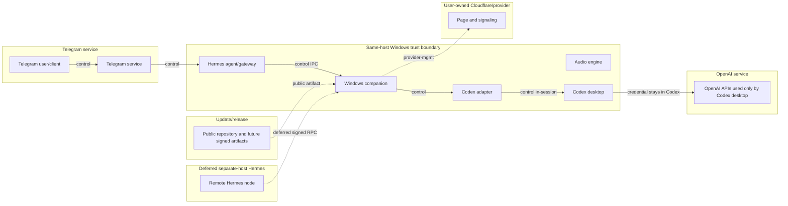
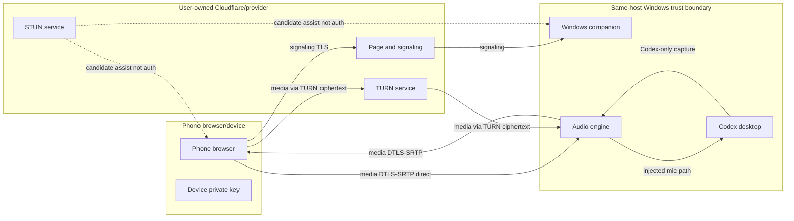

# Data flow v0

Version: v0
Date: 2026-09-01
Checkpoint: CP-003
Status: **architecture baseline; no runtime data path is implemented**

Related: [threat model v0](threat-model-v0.md), [ADR 0001](../adr/0001-user-owned-infrastructure-no-mandatory-shared-service.md), [product plan](../plan.md)

This catalog describes planned data movement. Flows, storage, and deletion behavior are **required** or **proposed** unless labeled a present-day trust assumption. Nothing here proves that a companion, page, or provider adapter exists.

## 1. Purpose and notation

### Data classifications

| Class | Meaning |
|---|---|
| Credential/secret | Keys, tokens, passwords, pairing codes, TURN credentials, IPC secrets |
| Sensitive content | Audio, prompts, task bodies, model responses, transcripts |
| Sensitive metadata | Task identity, device labels, session IDs, capability results |
| Operational metadata | Versions, state names, coarse timing, sanitized error categories |
| Public artifact | Source, signed releases, checksums, documentation |

### Arrow labels

- **control**: owner or Hermes commands that prepare or stop a host session
- **signaling**: HTTPS/WebSocket session negotiation after a page load
- **media**: WebRTC audio
- **provider-mgmt**: user-owned account operations such as route start/stop and TURN minting

## 2. Component and trust-boundary diagrams

### 2.1 Control plane

The dashed remote Hermes node is a **future** separate-host route. The first intended topology is same-host Hermes and Codex.

### 2.2 Media and signaling plane

STUN assists candidate discovery and does not authenticate the user. TURN relays encrypted packets and is not granted decoded audio.

## 3. Data-flow catalog

| ID | Source | Destination | Trigger | Data | Class | Transport | Planned authentication | Permitted persistence | Forbidden logging | Owning checkpoint |
|---|---|---|---|---|---|---|---|---|---|---|
| DF-01 | Telegram user/client | Hermes agent/gateway | Owner message | New/resume/end/status intent | Sensitive metadata | Telegram service | Inherited Hermes owner policy | None in the bridge | Raw message text if it contains secrets or task bodies | CP-114 |
| DF-02 | Hermes agent/gateway | Windows companion | Tool invoke after owner intent | Narrow operation request | Operational metadata plus task selectors | Same-host IPC | Planned ACL + IPC secret | Command IDs as needed | IPC secret, raw command lines | CP-102, CP-114 |
| DF-03 | Windows companion | Codex adapter / Codex desktop | Create or resume | Task identity to open | Sensitive metadata | Local desktop automation/API | Interactive user session; no OpenAI credential read | None beyond current session | Prompts, task content | CP-011 to CP-016 |
| DF-04 | Codex adapter | Hermes via companion | Task list request | Up to ten recent supported task descriptors | Sensitive metadata | IPC | Same as DF-02 | Ephemeral list | Unredacted titles in diagnostics | CP-012 |
| DF-05 | Companion | Hermes | Voice ready after verify | Ready/not-ready, error category | Operational metadata | IPC then Telegram | Same as DF-01/DF-02 | None | Task content | CP-014 |
| DF-06 | Companion | User-owned provider | Setup or session start | Route start, hostname, STUN, TURN mint | Credential/secret at API; hostname is address | Provider TLS | OS-protected provider credentials | Hostname/config handles, not raw tokens in files | Provider tokens | CP-041, CP-121 |
| DF-07 | Phone browser | Page/signaling endpoint | Open current link | Page assets | Public artifact | HTTPS TLS | Server TLS; URL is not auth | Cached page assets per browser policy | None beyond ordinary HTTPS | CP-031, CP-113 |
| DF-08 | Phone and companion | Each other | First-time pairing | Device public key, pairing code, friendly name | Credential/secret plus metadata | TLS signaling | One-time code, rate limit | Host: public key + trust record. Phone: private key | Pairing code, private key | CP-044, CP-122 |
| DF-09 | Phone browser | Companion session | Join after Hermes activation | Signed challenge, session id, device id | Sensitive metadata | TLS signaling | Device key, host/session/device binding | Ephemeral session state | Challenge secrets | CP-044, CP-123 |
| DF-10 | Phone and companion | Each other | WebRTC negotiate | SDP/ICE signaling | Sensitive metadata | TLS WebSocket | Session auth from DF-09 | None | SDP/ICE payloads | CP-032, CP-042 |
| DF-11 | Phone audio engine | Codex microphone path | Active call | Phone PCM/Opus decoded to injection | Sensitive content | Local audio graph | Device pin; no physical-mic fallback | Memory only | Audio | CP-021, CP-023 |
| DF-12 | Codex desktop | Phone | Active call | Codex-only output audio | Sensitive content | Local capture then DTLS-SRTP | Process-specific capture | Memory only | Audio, system sounds | CP-022, CP-023 |
| DF-13 | Phone and companion | Direct WebRTC path | ICE success | Encrypted media | Sensitive content | DTLS-SRTP | After DF-09 | None | Addresses, SDP | CP-042 |
| DF-14 | Phone and companion | TURN | Direct path blocked | Encrypted media packets | Sensitive content | TURN + DTLS-SRTP | Short-lived TURN credentials | None | TURN secrets, audio | CP-043 |
| DF-15 | Phone | Companion | Reconnect within grace | Fresh signed challenge | Sensitive metadata | TLS signaling | Valid device trust; no new pairing code | Ephemeral | Secrets | CP-045, CP-117 |
| DF-16 | Phone or Hermes | Companion | End Session | End command | Operational metadata | TLS or IPC | Owner or paired device in-session | Invalidate session/TURN | Content | CP-045, CP-117 |
| DF-17 | Companion | Provider | End or uninstall | Route stop, optional resource cleanup | Provider-mgmt | Provider TLS | OS-protected credentials; user cleanup choice | Config handles | Tokens | CP-121, CP-134 |
| DF-18 | Companion | Local diagnostics | User requests support bundle | Operational metadata only | Operational metadata | Local files | Local user | Bounded retention; preview/scrub | Content, secrets, paths, IPs | CP-104, CP-153 |
| DF-19 | Owner via Hermes/setup | Companion device store | Revoke device | Device id | Sensitive metadata | IPC | Owner authorization | Delete or mark revoked trust record | Private keys | CP-044, CP-122 |
| DF-20 | Update source | Installer/companion | User update | Signed artifacts | Public artifact | TLS | Planned signatures/checksums, **not implemented yet** | Installed binaries | Signing keys | CP-134, CP-154 |
| DF-21 | Deferred remote Hermes | Companion | Later separate-host command | Narrow RPC | Operational metadata | Encrypted control channel | Planned node keys | None extra | Windows/OpenAI credentials must not flow | CP-140, CP-141 |

## 4. Storage and retention catalog

| Component | May persist | Must not persist | Deletion / revocation |
|---|---|---|---|
| Telegram user/client | Ordinary Telegram history under Telegram's policy | Bridge audio, pairing private keys | Out of bridge control |
| Hermes agent/gateway | Native Hermes config already used for Telegram | OpenAI credentials, audio, TURN secrets | Owner manages Hermes config |
| Windows companion | Device public keys and trust records; IPC secret; provider secret handles; sanitized logs | Audio, transcripts, prompts, session/TURN credentials after end | Revoke devices; rotate IPC secret; uninstall removes project-created local state when requested |
| Codex desktop | Codex's own task and account state | Nothing added by the bridge | End Session does not delete tasks |
| Audio engine | Nothing durable | PCM, encoded audio | Buffers released on end/crash recovery |
| Phone browser | Device private key and trust metadata | Audio, pairing codes, TURN credentials | Clearing site data requires re-pair. Revocation ignores the old key. |
| User-owned provider | Hostname/route objects the user owns | Decoded audio | Stop route; user-approved cleanup of project-created resources |
| STUN / TURN | Ephemeral allocations | Decoded media | Credentials expire; End Session invalidates |
| Update source | Public releases | User secrets | Signature rotation is a future maintainer process |

Audio, content, live session identifiers, and TURN credentials are ephemeral or not persisted by the bridge.

## 5. Lifecycle data minimization

| Step | Created | Retained | Invalidated or deleted |
|---|---|---|---|
| One-time setup | IPC secret, optional provider secret handle, device pairing records, capability check results | Trust records, protected secrets | Pairing codes after success or expiry |
| Start (new or resume) | Ephemeral session id, challenge, optional route, short-lived TURN | Task identity for the active session only | Previous unused challenges |
| Active call | In-memory audio buffers | Nothing durable | Buffers continuously reused, not stored |
| Reconnect grace | Fresh challenge | Device trust; session binding until timeout | Old challenge |
| End Session | Cleanup record (operational) | Codex task unchanged | Media, Voice mode, session id, TURN credentials, in-memory audio |
| Revoke device | Revocation mark | Remaining devices | Target trust record; future joins fail |
| Uninstall | User choice about provider resources | Nothing if cleanup requested | Local companion state; optional provider objects created by the product |
| Crash recovery | Reconciliation of stale session | Codex task | Orphaned Voice/media/TURN without deleting the task |

## 6. Owner authorization assumptions

Hermes inherits owner authorization from a correctly configured Hermes/Telegram policy. The plugin **must not** duplicate or extract Telegram credentials.

The companion accepts only narrow authenticated operations. It **must not** treat arbitrary Telegram text as authority. It **must not** treat possession of a web link as authority.

If Hermes authorization cannot identify the owner reliably, session activation **must** be disabled rather than broadened. Fail closed.

Same-host IPC is a planned per-user local control channel. Separate-host Hermes is deferred and **must** add node pairing and signed RPC before it is allowed to invoke the same operations.

## 7. Contradiction check

Checked against the canonical product plan's packaging, lifecycle, user-owned networking, pairing, privacy, and separate-host sections.

| Plan point | Data-flow treatment | Result |
|---|---|---|
| One product package with bundled phone page; no separate frontend project | DF-07 serves bundled assets through the companion or a user-owned provider adapter | No contradiction found |
| Three lifecycles remain separate; End Session preserves the Codex task | DF-16/DF-03 and section 5 invalidate media/Voice/session only | No contradiction found |
| User-owned page/signaling, STUN, and TURN as separate concerns | Diagrams and DF-06/DF-13/DF-14 keep them distinct | No contradiction found |
| URL is an address, not a secret; pairing plus session auth | DF-07 vs DF-08/DF-09 | No contradiction found |
| Pairing: device key, one-time code, 30-day default trust, revocation | DF-08, DF-19, storage catalog | No contradiction found |
| Reconnect without new pairing code; End Session invalidates session/TURN | DF-15, DF-16 | No contradiction found |
| No bridge recording or added transcript; no silent mic/system fallback | DF-11, DF-12, threat-model invariants | No contradiction found |
| Same-host first; separate-host later with credentials staying put | Control diagram dashed node; DF-21 | No contradiction found |
| Cloudflare as intended first candidate; custom domain not required; Quick Tunnels development-only | ADR 0001; this catalog does not freeze Workers/Tunnel/TURN product details | No contradiction found |
| No mandatory project-operated shared service | ADR 0001; provider-mgmt stays in the user account | No contradiction found |
